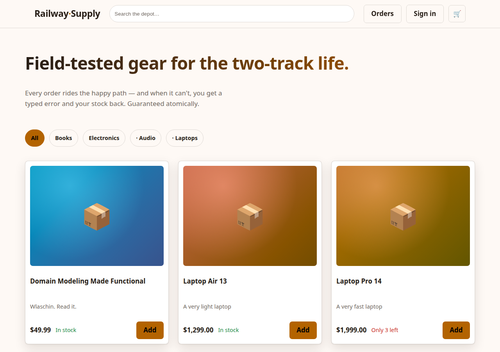
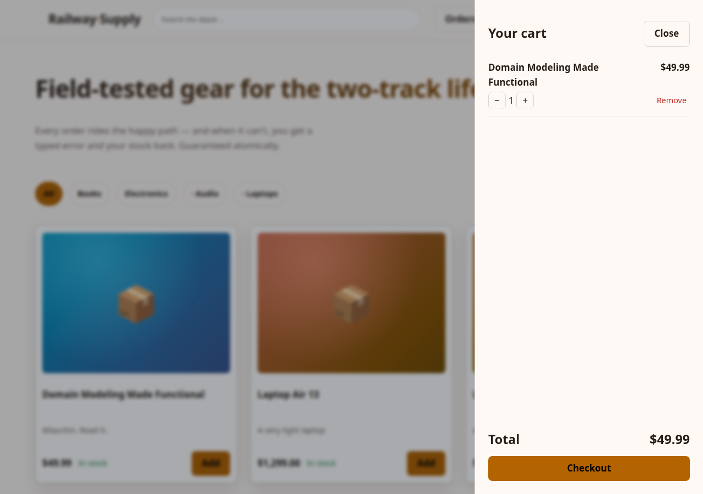

# effect-fp-skill-examples

[](https://github.com/mikezupper/effect-fp-skill-examples/actions/workflows/ci.yml)
[](LICENSE)
[](https://effect.website)
[](https://lit.dev)
[](https://www.typescriptlang.org/)
[](https://fsharpforfunandprofit.com/rop/)
[](#the-testing-story)
[](#3-ecommerce-ui--lit-ssr-storefront)
[](#the-css-story)
[](#the-skills-under-test)

Three working applications that battle-test a set of [Claude Code skills](https://code.claude.com/docs/en/skills) — opinionated instruction sets that steer an AI coding agent toward functional-programming rigor, production discipline, and platform-native frontends. This is the **proof repo**: every pattern the skills preach is exercised here by running code with passing test suites, and every bug found building these apps was fed back into the skills as new guidance.

| App | What it is | Stack | Proves |
|---|---|---|---|
| [`shortlink/`](shortlink/) | URL shortener with expiring links | Effect 4, `effect/http-api` HttpApi | The core skill loop: brands, railway errors, TestClock, property tests |
| [`ecommerce/`](ecommerce/) | Full commerce API — catalog, search, auth, cart, atomic checkout, order history | Effect 4, `effect/sql` + SQLite (`node:sqlite`) | Domain modeling at scale, transactions on the error track, auth middleware |
| [`ecommerce-ui/`](ecommerce-ui/) | Server-rendered storefront over the ecommerce API | Lit 3, `@lit-labs/ssr`, Vite, modern CSS | SSR/CSR hybrid, hydration discipline, one-hue oklch design system |

<p align="center">
  
</p>

---

## Table of contents

- [Goals & motivation](#goals--motivation)
- [The skills under test](#the-skills-under-test)
- [Quick start](#quick-start)
- [The apps](#the-apps)
- [Configuration](#configuration)
- [The testing story](#the-testing-story)
- [The CSS story](#the-css-story)
- [What building these taught the skills](#what-building-these-taught-the-skills)
- [Repo layout & scripts](#repo-layout--scripts)

## Goals & motivation

AI coding agents write plausible code by default: `async/await` with invisible exceptions, `null` checks, `any` under pressure, happy paths that demo well and fall over in production. Skills fix this by encoding an opinionated engineering philosophy the agent must follow — but a skill that has never built anything is just an essay.

This repo exists to close that loop. Its goals:

1. **Prove the skills produce working software** — not snippets: apps with domain models, persistence, auth, transactions, a rendered frontend, and test suites that run in CI.
2. **Battle-test the guidance.** Each app was built strictly following the skills. Where reality diverged from the docs — a hydration trap, an escaping bug, a missing dependency — the finding went back into the skill ([see below](#what-building-these-taught-the-skills)). The skills are living documents; this repo is their test bench.
3. **Serve as reference implementations.** If you want to see what "railway-oriented programming in TypeScript" or "SSR Lit with a functional backend" actually looks like end-to-end, clone and run.

The engineering philosophy running through everything comes from Scott Wlaschin's [F# for Fun and Profit](https://fsharpforfunandprofit.com): [railway-oriented programming](https://fsharpforfunandprofit.com/rop/), [designing with types](https://fsharpforfunandprofit.com/series/designing-with-types/), parse-don't-validate, functional core / managed shell, and [property-based testing](https://fsharpforfunandprofit.com/series/property-based-testing/) — realized in TypeScript through [Effect](https://effect.website).

## The skills under test

| Skill | Repo | What it mandates |
|---|---|---|
| **effect-fp-skill** | [mikezupper/effect-fp-skill](https://github.com/mikezupper/effect-fp-skill) | Effect everywhere: typed error channels, branded types, `Schema` at every boundary, capability-based DI via Layers, one runtime entry point, production checklist as definition-of-done, mandatory self-review pass |
| **modern-css** | [mikezupper/modern-css-skill](https://github.com/mikezupper/modern-css-skill) | Platform-native CSS: `@layer` architecture, one-hue oklch token systems, `light-dark()` theming, container queries, `<dialog>`/popover, `@starting-style` animations — no utility frameworks, no JS layout hacks |
| **lit-web-apps** | [mikezupper/lit-web-apps-skill](https://github.com/mikezupper/lit-web-apps-skill) | Pure Lit applications: SSR/SSG/CSR from one pipeline, platform-native routing (URLPattern + Navigation API), signals/context/task state ladder, real-browser testing |

## Quick start

Requires **Node ≥ 24** (native `URLPattern`) and npm.

```bash
git clone https://github.com/mikezupper/effect-fp-skill-examples
cd effect-fp-skill-examples
npm run install:all      # installs all three apps

npm test                 # typecheck + full test suites, all apps

npm run dev              # starts the ecommerce API (:3001) AND the storefront (:5173)
# open http://localhost:5173      → the storefront
# open http://localhost:3001/docs → Swagger UI for the API
```

Or run pieces individually:

```bash
npm run dev:api                          # ecommerce backend on :3001
npm run dev:ui                           # storefront on :5173 (expects the API on :3001)
cd shortlink && npm run dev              # the URL shortener on :3000
```

## The apps

### 1. `shortlink` — the minimal complete loop

A URL shortener with optional TTLs. Small on purpose: it demonstrates the entire effect-fp skill surface in ~250 lines.

- **Branded domain**: `Slug`, `TargetUrl` — a slug cannot be passed where a URL belongs, enforced at compile time; patterns validated once by `Schema` at the boundary.
- **Railway errors**: `SlugTaken` → 409, `LinkNotFound` → 404, `LinkExpired` → 410 — each a serializable `Schema.TaggedError` carrying the data handlers need, mapped to statuses only in the HTTP adapter.
- **Time and randomness as capabilities**: expiry reads the `Clock`, slug generation uses the `Random` service — which is why the test suite can fast-forward 61 virtual minutes in microseconds with `TestClock` and stay deterministic.
- **One entry point**: `Layer.launch(...).pipe(NodeRuntime.runMain)` — graceful shutdown included.

### 2. `ecommerce` — the skill at production scale

Catalog, search, hierarchical category navigation, register/login, cart, checkout, order history. Real persistence (`effect/sql` + `@effect/sql-sqlite-node`), real auth (scrypt + bearer sessions), real transactional integrity.

The centerpiece is **checkout as a workflow-owned transaction**:

```
sql.withTransaction(
  read cart → reserve stock line-by-line → snapshot prices → write order → clear cart
)
```

Any failure — `InsufficientStock`, a defect, an interruption — rolls the whole thing back. Repositories never open transactions; they inherit the connection through the fiber context. The test suite proves the atomicity: a mid-checkout stock failure leaves stock, cart, and order history untouched.

Other highlights:

- `Model`-style repos decode **every** DB row through `Schema` — the DB is a boundary like any other
- `HttpApiMiddleware` provides `CurrentUser`: cart/order endpoints *cannot be wired* without an auth implementation — enforced by the compiler
- Anti-enumeration auth (`InvalidCredentials` for both unknown email and wrong password), `Redacted` passwords end-to-end
- Order lines snapshot name + price at purchase time — catalog edits can't rewrite history
- OpenAPI + Swagger UI generated from the same schemas that validate requests

### 3. `ecommerce-ui` — Lit SSR storefront

"Railway Supply Co." — a server-rendered storefront over the ecommerce API, built with the lit-web-apps + modern-css skills.

- **Mixed rendering per route**: catalog and product pages are **SSR** (streamed Declarative Shadow DOM, real per-route titles/meta — readable with JS disabled); order history is **CSR** (auth-gated, no SEO value). One route table, one component set.
- **Platform-native router**: ~80 lines over `URLPattern` + the Navigation API, with view transitions on SPA navigation. Plain `<a href>` everywhere.
- **Hydration done right** (the hard-won part — see [findings](#what-building-these-taught-the-skills)): serialized `__DATA__` seeding, session restore deferred until the whole tree hydrates, Task INITIAL/PENDING alignment.
- **Type-safe wire contract without sharing runtime code**: DTO types derive from the backend's own schemas via `Schema.Schema.Encoded<typeof Order>` — imported **type-only**, so the UI bundle contains zero Effect, yet a backend schema change breaks the UI build.
- **State ladder**: signals for cart/session (shared reactive), `@lit/task` for fetches, reactive properties for local state.

<p align="center">
  
</p>

## Configuration

Everything configurable is an environment variable read through Effect `Config` (backend) or process env (UI dev server). Defaults work out of the box.

| App | Variable | Default | Meaning |
|---|---|---|---|
| shortlink | `PORT` | `3000` | HTTP port |
| ecommerce | `PORT` | `3000` (docs use `3001`) | HTTP port |
| ecommerce | `DB_FILE` | `ecommerce.db` | SQLite file; `:memory:` for ephemeral |
| ecommerce-ui | `UI_PORT` | `5173` | Dev server port |
| ecommerce-ui | `API_URL` | `http://localhost:3001` | Where **SSR** finds the API (browser traffic goes through the Vite `/api` proxy, configured in `vite.config.ts`) |

The ecommerce DB self-migrates and self-seeds on boot (idempotent DDL + fixed-id catalog). Delete the DB file to reset. Seeded demo data: categories `electronics/laptops/audio/books`, five products with fixed ids like `p-laptop-pro`.

## The testing story

Each layer of the pyramid uses the cheapest tool that gives real confidence — and several bugs in this repo were caught by exactly the tier the skills mandate:

| Tier | Tool | Example from this repo |
|---|---|---|
| Pure domain properties | `it.prop` with arbitraries derived from the schemas | Found that `buildCategoryTree` silently dropped self-parented categories — shrunk to a minimal counterexample automatically |
| Deterministic workflows | `it.effect` + `TestClock` + Layer-swapped fakes | Link expiry tested across 61 virtual minutes in ~10ms; checkout atomicity proven against in-memory SQLite |
| Real-browser components | Vitest browser mode (Playwright/Chromium) | Shadow-DOM rendering, event composition, disabled states |
| End-to-end | Playwright scripts | Register → cart → checkout → order history → search, asserting zero console errors — which is how every hydration bug was caught |

No mocking frameworks anywhere: fakes are `Layer` substitutions on the backend and fetch-level fakes in the UI.

## The CSS story

The storefront's entire theme derives from **one number** — `--hue: 62` — through oklch relative color syntax and `color-mix()`: brand, hover states, surfaces, borders, text tints, both light and dark themes (`light-dark()`, no duplicate variable sets). Layout is container-query-driven (cards reflow by their own width, not the viewport), overlays are real `<dialog>` elements in the top layer with `@starting-style` entry/exit animations, forms use `:user-valid/:user-invalid`, and the whole thing respects `prefers-reduced-motion`. No CSS framework, no resets beyond ~10 lines, no JS measuring layout.

## What building these taught the skills

The feedback loop is the point of this repo. Findings that became skill guidance:

| Finding | Where it went |
|---|---|
| `@types/node` missing from the scaffold (only typecheck failure in the first app) | effect-fp-skill `references/scaffold.md` |
| Recursive schemas need an `identifier` annotation or OpenAPI generation dies at runtime; recursive traversals must be cycle-safe | effect-fp-skill `references/domain-types.md` |
| Bindings inside `<script>` are HTML-escaped by Lit SSR — serialized JSON must be emitted via one audited `unsafeHTML` | lit-web-apps-skill `references/rendering-modes.md` |
| A shell's `firstUpdated` fires while children are still hydrating — restoring localStorage state there corrupts their hydration (the "double header" bug) | lit-web-apps-skill `references/data-and-state.md` |
| `@lit/task` renders INITIAL on the server but PENDING on first client render — they must produce identical templates | lit-web-apps-skill `references/data-and-state.md` |
| Slotted children are only styleable via `::slotted()` — child combinators silently skip them | lit-web-apps-skill `references/components.md` |

Each row was a real, reproduced failure — not a hypothetical.

## Repo layout & scripts

```
effect-fp-skill-examples/
├── shortlink/          # app 1 — see its README
├── ecommerce/          # app 2 — see its README
├── ecommerce-ui/       # app 3 — see its README (depends on ecommerce/ for types + API)
├── docs/screenshots/
├── .github/workflows/ci.yml
└── package.json        # root convenience scripts (below)
```

| Root script | Does |
|---|---|
| `npm run install:all` | `npm ci` in all three apps (order matters: ecommerce before ecommerce-ui) |
| `npm run typecheck` | `tsc --noEmit` everywhere |
| `npm test` | typecheck + all test suites |
| `npm run dev` | ecommerce API on `:3001` + storefront on `:5173`, one command |
| `npm run dev:api` / `dev:ui` | each half separately |

## License

Text, markup, and code licensed under [CC BY 4.0](https://creativecommons.org/licenses/by/4.0/) © Mike Zupper. The skills' engineering philosophy credits [Scott Wlaschin](https://fsharpforfunandprofit.com), [Effect](https://effect.website), and [Lit](https://lit.dev); none of them endorse this repo.
